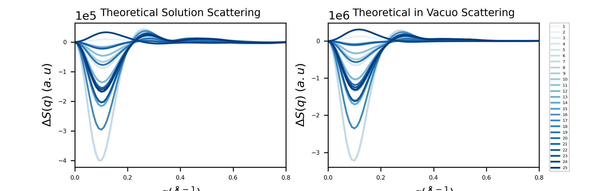

## Getting started with the jupyter notebook

Please use the following steps in order to get started:

1. Install minconda or anaconda (this can be used to install jupyter notebook and other python software)

2. Download the repository from GitHub

3. In your terminal, cd into the dowloaded directory

4. Create environment by using the daniel_jupyter.yml  file

    - look for a file named daniel_project.yml containing the necessary software packages required to run the notebook
    - create the new eviroment using the follwing commands in your terminal

    ```.py
    conda env create -f daniel_jupyter.yml
    ```
5. Activate the environment

    ```.py
    conda activate daniel_project
    ```
6. Check the contents of the environment by typing

    ```.py
    conda list
    ```

7. Check also what environments you have. You should see daniel_project in this list

    ```.py
    conda env list
    ```
8. Install ipykernel - Allows you to use the environment as a kernel in Jupyter

    ```.py
    pip install --user ipykernel
    ```


9. Using ipykernel, to get the environment to Jupyter

    ```.py
    python -m ipykernel install --user --name=daniel_project
    ```

10. Run jupyter notebook from the command-line in terminal

    ```.py
    jupyter notebook
    ```
## Review of Notebook:

In accordance with Najlas posted issue, I have decreased xlabel and ylabel font size.
Regarding issues reviewed by Tinna, several changes and updates has been made to the Notebook. First, the description of Readme to get started with notebook has been altered, correct name of .yml was given and correct environment name when activating with conda. Also, two more points was added regarding the installation of ipykernel, which allows the user to upload the active enviroment as a kernel to Jupyter notebook. Second, i added the feature of saving the dataframes created with pandas to disk, so that all the dataframes created in each code cell is saved to a csv file with a specified name. Third, the correct size of figures was implemented, 183 mm wide and 300 dpi, to all figures. Consequently, the font size of xlabel, ylabel, title was altered to fit the new dimensions of figures. The ylabel ticks needed to be converted to scientific notation (exponential form) instead which was added with 

```.py
plt.ticklabel_format(axis="y",style="sci",scilimits=(0,0))
```
Two of my figures plots 25 lines which had initally a default color palette. The color palette was changed using a sequential color palette from seaborn, and a legend was added to the figures so that the user can understand and visualize the data better. 

I usally make these type of scripts in matlab, which is not as versatile as jupyter when it comes to being user friendly, in regards to someone who has never used the code, to be able to open it and understand what the script does and what it means. Therefore, the ability to make markdown blocks with descriptions and uploading images together with code and figures is a very good way of preserving the purpose and function of the script for other users than the person who wrote it. It makes it easier to pass on and share. Pandas was very useful for loading dataframes and choosing columns made it easier to handle. matplotlib and seaborn was the best feature due to the many possibilies of visualizing the data, and the sequential color palette was to me the most interesting feature, which I will make sure to implement in future scripts. 




